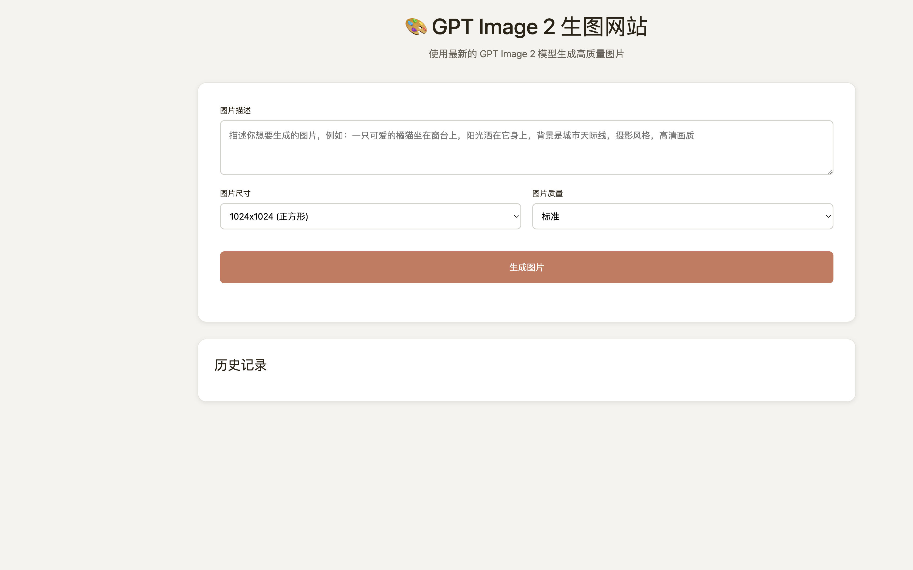

# image-generator

[](https://github.com/jeffloo886/image-generator/actions/workflows/ci.yml)
[](LICENSE)

A minimal **Flask** web demo for [OpenAI image generation](https://platform.openai.com/docs/guides/images) (GPT Image 2).  
Use it to prototype prompts, sizes, quality settings, local history, and downloads—without a larger framework.

[中文文档](#中文文档) · [Screenshot](#screenshot) · [Quick start](#quick-start)

## Screenshot



## Features

- GPT Image 2 via the OpenAI Python SDK
- Sizes: `1024x1024`, `1792x1024`, `1024x1792`
- Quality: standard / hd
- Saves PNGs under `generated_images/`
- History list and download in the browser

## Quick start

```bash
git clone https://github.com/jeffloo886/image-generator.git
cd image-generator
python3 -m venv .venv
source .venv/bin/activate
pip install -r requirements.txt
cp .env.example .env
# Edit .env and set OPENAI_API_KEY
python app.py
```

Open **http://localhost:2345**

> **Note:** Image generation requires a paid OpenAI API key. CI runs lint only and does not call the API.

## Project layout

| Path | Description |
|------|-------------|
| `app.py` | Flask routes: generate, history, serve files |
| `templates/index.html` | Single-page UI |
| `.env.example` | Environment variable template |
| `generated_images/` | Local output (gitignored except `.gitkeep`) |

## Security

- Never commit `.env` or API keys.
- Intended for **local development**; do not expose `debug=True` on the public internet without hardening (auth, HTTPS, validated filenames).

## License

MIT — see [LICENSE](LICENSE).

---

## 中文文档

使用 GPT Image 2 模型的轻量生图 Web 应用。

### 功能特点

- 使用 GPT Image 2 模型
- 多种尺寸（1024x1024、1792x1024、1024x1792）
- 标准 / 高清质量
- 自动保存到 `generated_images/`
- 历史记录与下载

### 安装步骤

```bash
pip install -r requirements.txt
cp .env.example .env
# 编辑 .env，填入 OPENAI_API_KEY
python app.py
```

浏览器访问：**http://localhost:2345**

### 技术栈

- Backend: Flask (Python)
- Frontend: HTML + CSS + JavaScript
- Model: GPT Image 2 (OpenAI)
